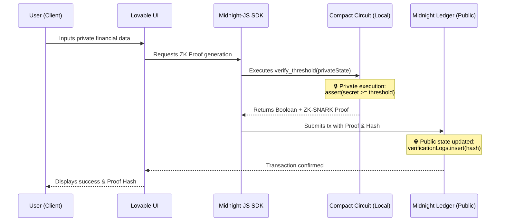

# ZeroScore Midnight 🛡️

**Verifiable & Privacy-Preserving Financial Credentials**

🌐 **Live Demo:** [https://zeroscore-midnight.vercel.app](https://zeroscore-midnight.vercel.app)

---

## 🎯 The Problem & Our Solution

**The Problem:** In traditional finance and Web3 lending, proving your financial eligibility (like credit score, wallet balance, or income) requires exposing sensitive data. This leads to privacy leaks, identity theft, and reluctance to participate in DeFi protocols.

**The Solution with Midnight:** ZeroScore uses the **Midnight Network** and its Zero-Knowledge (ZK) capabilities via the **Compact DSL** to solve this. Instead of sharing your exact financial figures, you generate a ZK-Proof locally. The proof mathematically guarantees that you meet a required threshold (e.g., `Balance > $10,000`) **without ever exposing the actual number to the public network**. Only a verified boolean result and a unique commitment hash are emitted to the public ledger.

---

## 🏗️ Architecture Diagram



---

## 💻 Local Setup Instructions

This project is built using Vite, React, and Tailwind (Lovable).

### Prerequisites
- Node.js (v18+)
- npm or bun

### 1. Install Dependencies
```bash
npm install
```

### 2. Environment Variables
Copy the example environment file and fill in your Midnight RPC endpoints. (Note: Fallbacks to mocked testing environment if Midnight wallet is unattached).
```bash
cp .env.example .env
```

### 3. Contract Compilation (Compact)
*To compile the `.compact` file locally, you need the Midnight Compact compiler installed.*
```bash
# Navigate to the contracts directory
cd contracts

# Compile the contract to generate the verification keys and circuit data
compactc zero_score.compact
```

### 4. Run Development Server
```bash
npm run dev
```
Navigate to the URL provided in your terminal (usually `http://localhost:8080`) to interact with the Dashboard.

---

## 🚀 Deployment (Vercel)

This project is fully configured for Vercel. 

*Note for Next.js users: This frontend was generated by Lovable using Vite. Vercel handles this automatically.*

In your Vercel dashboard:
- **Framework Preset:** Vite
- **Build Command:** `npm run build`
- **Output Directory:** `dist`

Add the environment variables from your `.env` file into your Vercel project settings before deploying.
